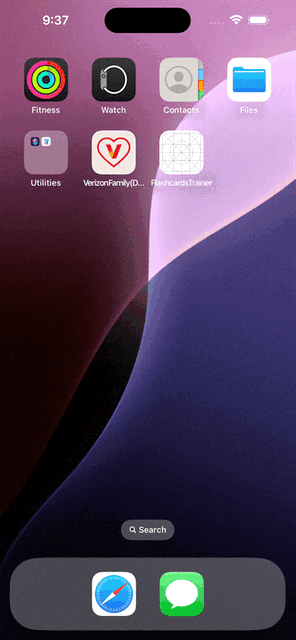

# FlashcardsTrainer
FlashcardsTrainer is a simple and effective flashcard application designed to help users learn and memorize information . The app allows users to create, edit, and delete flashcards. Each flashcard contains a question on one side and an answer on the other. Users can flip the cards to reveal the answers and track their learning progress by marking cards as known or unknown.
## Features
- A ”+” toolbar button to insert a new Card with question and answer.
- Click on the flash cards to edit their content.
- Swipe left to reveal a "Delete Card" icon to delete a flash card. Show an alert screen to confirm deletion of a flash card.
- A flip icon to reveal the answer. Flash card should turn over with a smooth animation.
- Flash cards that are flipped at least once should have a green background color. Flash card with unrevealed answers should have a red background color.
- A toolbar action to mark all flash cards as known.
- A toolbar action to reset all flash cards to unknown.
- A toolbar action to switch language to Spanish, English, or System Default Language.

## Installation
1. Clone the repository:
    ```bash
    git clone
    ```
2. Open the project in Xcode.
3. Build and run the application on a simulator or physical device.
## Usage
1. Click on the ”+” toolbar button to insert a new Card with question and answer
2. Click on the flash cards to edit their content.
3. Swipe left to reveal a "Delete Card" icon to delete a flash card. Show
    an alert screen to confirm deletion of a flash card.
4. Click on the flip icon to reveal the answer. Flash card should turn over
    with a smooth animation.
5. Use the toolbar actions to mark all flash cards as known, reset all flash cards to unknown, or switch language to Spanish, English, or System Default Language.
## Contributing
Contributions are welcome! Please fork the repository and create a pull request with your changes.
## License
This project is licensed under the MIT License. See the LICENSE file for details.
## UI Design
The user interface consists of the following components:
- A toolbar with buttons to add a new flashcard, mark all as known, reset all to unknown, and switch language.
- A collection view displaying flashcards with question and answer.
- Flashcards that can be tapped to edit content, swiped to delete, and flipped to reveal the answer.
- Flashcards with different background colors based on their known/unknown status.
- An alert dialog for confirming deletion of a flashcard.


Above is a gif describing the FlashcardsTrainer app in action.
